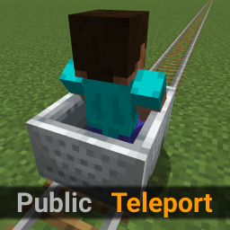

  

# Public Teleport

An easy to use Fabric Teleport Mod

- Homes, Warps, Back, Spawn, TPA, TPAhere
- Server-side or client-side (Multiplayer/Singleplayer, client-side installation is NOT need for server-side installation!)
- Minimal configuration with predefined sane values
- The only language is English at the moment, if you want to provide translations open an Issue

## Commands

| Command                | Only OP | Description                                                            |
| ---------------------- | :-----: | ---------------------------------------------------------------------- |
| **Spawn:**             |         |                                                                        |
| `/setspawn`            |    ✓    | Create a`spawn` warp and set world spawn at your present location/view |
| `/spawn`               |         | Teleport to spawn                                                      |
| **Warps:**             |         |                                                                        |
| `/setwarp <name>`      |    ✓    | Create a warp at your present location/view                            |
| `/delwarp <name>`      |    ✓    | Delete a warp                                                          |
| `/warp <name>`         |         | Teleport to a warp                                                     |
| `/warps`               |         | List all warps                                                         |
| **Homes:**             |         |                                                                        |
| `/sethome [<name>]`    |         | Set a new home (Default: `home`) at your present location/view         |
| `/delhome <name>`      |         | Delete an existing home                                                |
| `/home [<name>]`       |         | Teleport to a home (Default: `home`)                                   |
| `/homes`               |         | List all your current homes                                            |
| **Back:**              |         |                                                                        |
| `/back`                |         | Teleport to your last location before teleporting or dying             |
| **TPA:**               |         |                                                                        |
| `/tpa <player>`        |         | Request teleportation to`<player>`                                     |
| `/tpahere <player>`    |         | Request`<player>` to teleport to you                                   |
| `/tpcancel`            |         | Cancel your teleportation request                                      |
| `/tpaccept [<player>]` |         | Accept request from`<player>` (Default: Most recent)                   |
| `/tpdeny [<player>]`   |         | Deny request from`<player>` (Default: Most recent)                     |

## Configuration

On first run a config file is created in `config/public-teleport/config.json` with these defaults:

| Field            | Default | Description                                                                 |
| ---------------- | ------- | --------------------------------------------------------------------------- |
| `maxHomes`       | 10      | The maximum amount of homes a player can have                               |
| `requestTimeout` | 60      | How long a teleport request is active before it is removed in seconds       |
| `enableSpawn`    | true    | If the `/setspawn, /spawn` commands are enabled                             |
| `enableWarps`    | true    | If the `/setwarp, /delwarp, /warp, /warps` commands are enabled             |
| `enableHomes`    | true    | If the `/sethome, /delhome, /home, /homes` commands are enabled             |
| `enableBack`     | true    | If the `/back` command is enabled                                           |
| `enableTpa`      | true    | If the `/tpa, /tpahere, /tpcancel, /tpaccept, /tpdeny` commands are enabled |

To change these defaults edit the config file and restart your server.

## Installation

Requires [Fabric API](https://modrinth.com/mod/fabric-api) to be installed.

- Download the `.jar` file from the [Releases page](https://github.com/SebiTimeWaster/Public-Teleport/releases) page that fits your Minecraft version and put it into your `mods` folder on your server or client
- Edit the configuration as described in Configuration if needed
- Restart your server or client

## Migration from MiniTeleport

If you are migrating from [MiniTeleport](https://github.com/luxmiyu/miniteleport):

- Install Public Teleport, start your server and stop it once it has fully started
- Copy all files in `world/miniteleport/` to `config/public-teleport/`
